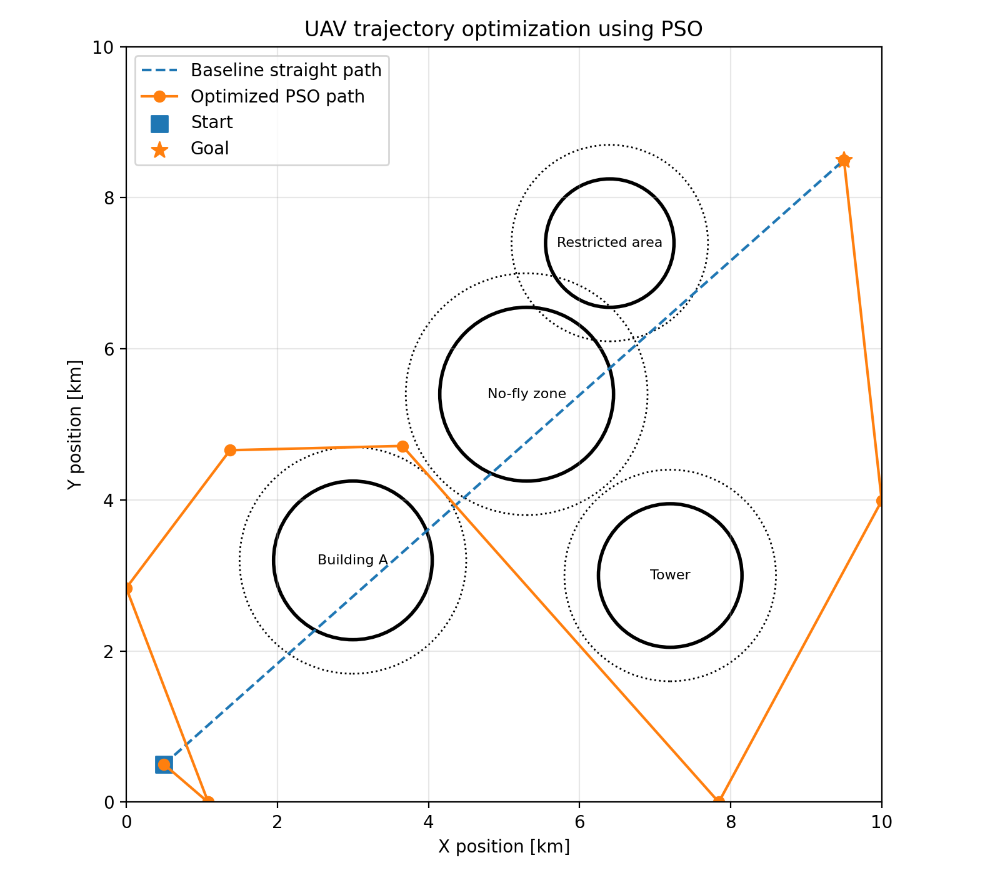
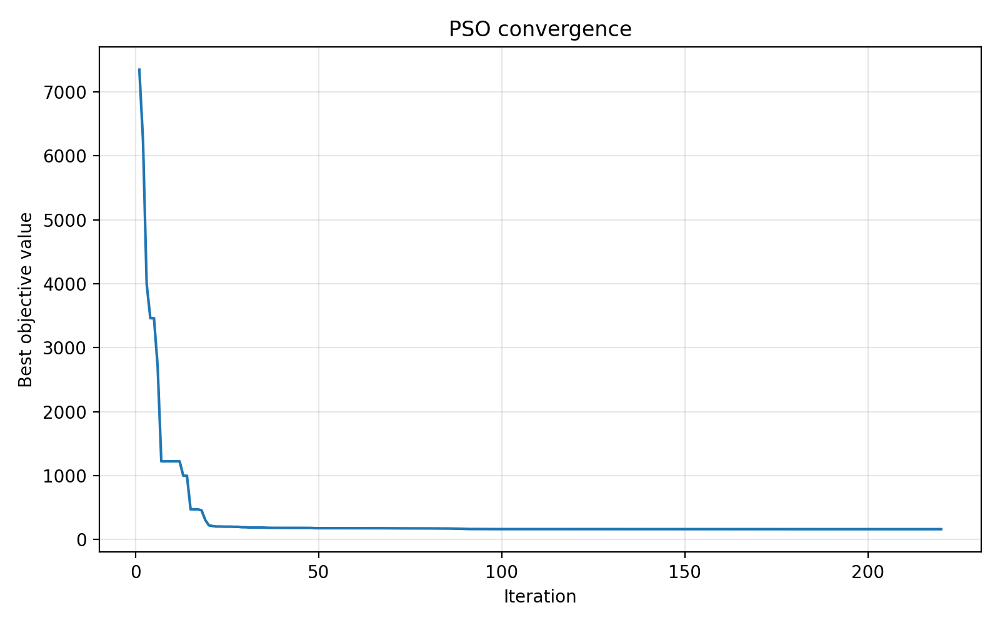

# Energy-Efficient UAV Trajectory Optimization using Particle Swarm Optimization in Python

This project demonstrates a simulation-based UAV path planning method using Particle Swarm Optimization (PSO). A UAV must fly from a start point to a target point while avoiding circular obstacles and minimizing a weighted objective containing distance, energy, smoothness, altitude change, and collision penalties.

The project is designed for research/internship applications related to UAV modeling, simulation, optimization, and autonomous systems.

## Key Features

- 2D UAV trajectory optimization with configurable waypoints
- Particle Swarm Optimization implemented from scratch
- Energy-aware objective function
- Obstacle avoidance with soft safety penalties
- Baseline path comparison
- Convergence plot and trajectory visualization
- Clean modular Python code for GitHub
- Technical report included in `report/`

## Mathematical Objective

The optimizer minimizes:

```text
J = w_d * Distance + w_e * Energy + w_s * Smoothness + w_c * CollisionPenalty
```

Where:

- `Distance` is total path length
- `Energy` approximates UAV energy demand using distance, acceleration/speed changes, and climb effort
- `Smoothness` penalizes sharp turns
- `CollisionPenalty` heavily penalizes entering or passing too close to obstacles

## Repository Structure

```text
uav_pso_trajectory_optimization/
├── README.md
├── requirements.txt
├── pyproject.toml
├── LICENSE
├── .gitignore
├── src/uav_pso/
│   ├── config.py
│   ├── environment.py
│   ├── objective.py
│   ├── pso.py
│   ├── visualization.py
│   └── main.py
├── scripts/
│   └── run_experiment.py
├── results/
│   ├── trajectory_comparison.png
│   ├── convergence.png
│   └── optimized_path.csv
├── report/
│   ├── technical_report.md
│   └── technical_report.pdf
└── tests/
    └── test_objective.py
```

## Quick Start

### 1. Create a virtual environment

```bash
python -m venv .venv
source .venv/bin/activate  # Linux/Mac
# .venv\Scripts\activate   # Windows
```

### 2. Install dependencies

```bash
pip install -r requirements.txt
```

### 3. Run the experiment

```bash
python scripts/run_experiment.py
```

This creates updated figures and path data inside `results/`.

## Example Output

The output includes:

### UAV Trajectory Comparison



### PSO Convergence Curve



## How to Present This Project in a CV

**Energy-Efficient UAV Trajectory Optimization using Particle Swarm Optimization**

- Built a Python-based UAV trajectory optimization simulation using Particle Swarm Optimization.
- Modeled UAV path planning with obstacle avoidance, safety constraints, and energy-aware cost functions.
- Designed objective terms for distance, smoothness, energy consumption, and collision penalties.
- Visualized optimized trajectories and convergence behavior using NumPy and Matplotlib.
- Prepared a technical report and GitHub-ready documentation for research presentation.

## Future Improvements

- Extend to 3D UAV flight dynamics
- Add wind disturbance modeling
- Compare PSO with Differential Evolution and Genetic Algorithms
- Implement PID-based trajectory tracking
- Connect the planner to PX4/ArduPilot SITL or ROS 2

## Author

Mahek Pankhaniya
