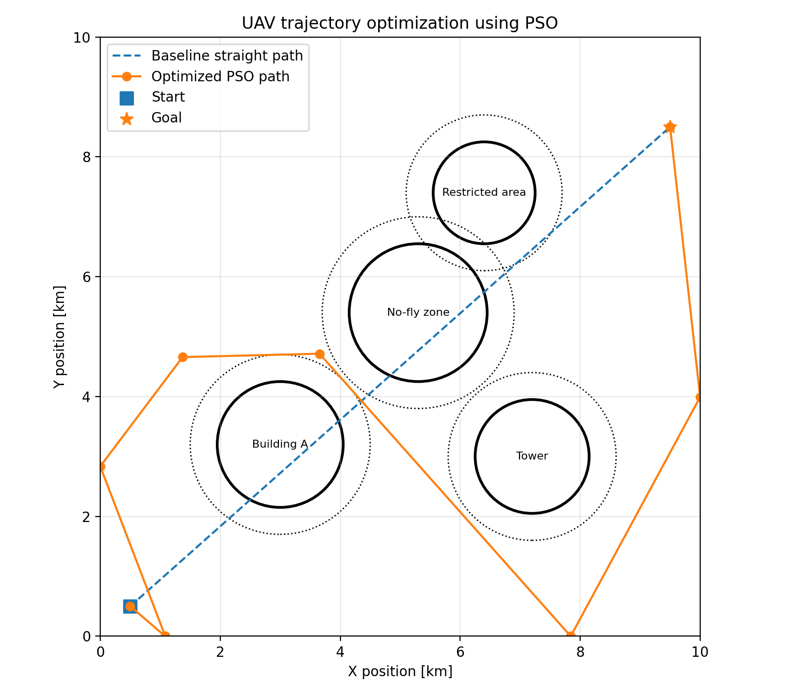
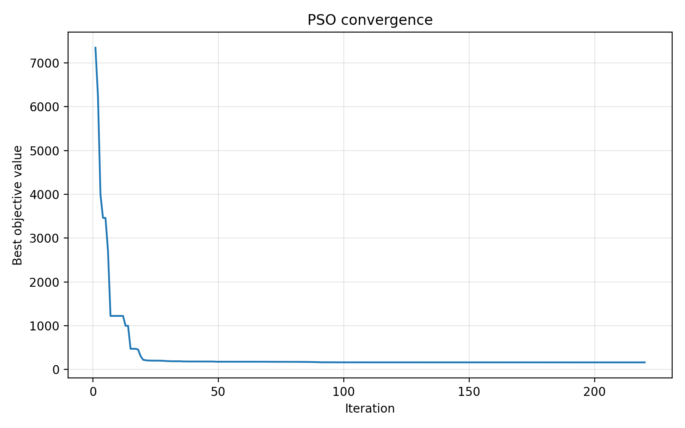

# Energy-Efficient UAV Trajectory Optimization Using Particle Swarm Optimization (PSO)

## Overview

This project presents a simulation-based framework for energy-efficient UAV trajectory optimization using Particle Swarm Optimization (PSO). The objective is to generate a collision-free trajectory between a predefined start and target location while minimizing a multi-objective cost function that considers travel distance, energy consumption, path smoothness, and obstacle avoidance.

The implementation is developed entirely in Python and demonstrates how population-based optimization techniques can be applied to autonomous path planning problems in obstacle-rich environments.

---

## Motivation

Trajectory planning is a critical component of autonomous UAV systems. Traditional shortest-path approaches often neglect energy efficiency, flight smoothness, and safety constraints.

This project addresses these challenges by formulating trajectory planning as a constrained optimization problem and solving it using Particle Swarm Optimization.

Applications include:

* Autonomous drone navigation
* Delivery and logistics systems
* Inspection and surveillance missions
* Search and rescue operations
* Intelligent transportation and robotics

---

## Key Features

* Particle Swarm Optimization implemented from scratch
* Energy-aware UAV trajectory planning
* Circular obstacle avoidance using penalty-based constraints
* Configurable environment and waypoint generation
* Multi-objective optimization framework
* Baseline path comparison
* Convergence analysis and visualization
* Modular and extensible Python architecture
* Research-oriented implementation suitable for further development

---

## Optimization Formulation

The optimizer minimizes the following objective function:

```text
J = w_d × Distance
  + w_e × Energy
  + w_s × Smoothness
  + w_c × CollisionPenalty
```

Where:

| Component         | Description                                           |
| ----------------- | ----------------------------------------------------- |
| Distance          | Total trajectory length                               |
| Energy            | Simplified energy consumption proxy                   |
| Smoothness        | Penalizes abrupt heading changes                      |
| Collision Penalty | Penalizes obstacle intersections and unsafe proximity |

The weighted objective encourages safe, smooth, and energy-efficient trajectories.

---

## Methodology

### Environment Setup

The simulation environment consists of:

* Start location
* Target location
* Multiple circular obstacles
* Safety buffer regions

### Trajectory Representation

A trajectory is represented by a sequence of intermediate waypoints connecting the start and target positions.

### Optimization Process

1. Initialize swarm particles
2. Generate candidate waypoint sets
3. Evaluate objective function
4. Update particle velocities and positions
5. Track global best solution
6. Repeat until convergence

---

## Repository Structure

```text
uav-trajectory-optimization-pso/
├── README.md
├── requirements.txt
├── LICENSE
├── .gitignore
├── config.py
├── environment.py
├── objective.py
├── pso.py
├── visualization.py
├── main.py
├── technical_report.pdf
└── results/
    ├── optimized_path.csv
    ├── summary_metrics.csv
    ├── trajectory_comparison.png
    └── convergence.png
```

---

## Installation

### Clone Repository

```bash
git clone https://github.com/Mahek010/uav-trajectory-optimization-pso.git
cd uav-trajectory-optimization-pso
```

### Create Virtual Environment

```bash
python -m venv .venv
```

Linux / macOS

```bash
source .venv/bin/activate
```

Windows

```bash
.venv\Scripts\activate
```

### Install Dependencies

```bash
pip install -r requirements.txt
```

---

## Running the Project

Execute:

```bash
python main.py
```

The program will:

* Optimize the UAV trajectory
* Generate convergence statistics
* Create visualizations
* Export performance metrics
* Save trajectory coordinates

---
## Results

### Optimized Trajectory

The optimized UAV trajectory successfully avoids obstacles while minimizing the weighted objective function consisting of distance, energy consumption, smoothness, and collision penalties.



### PSO Convergence

The convergence curve illustrates the optimization progress of the Particle Swarm Optimization algorithm over successive iterations.



### Generated Outputs

- Optimized UAV trajectory
- Baseline path comparison
- Obstacle avoidance visualization
- PSO convergence history
- Optimized waypoint coordinates (CSV)
- Summary performance metrics
### Optimized Trajectory


### PSO Convergence


### Trajectory Visualization

* Initial baseline trajectory
* Optimized UAV path
* Obstacle locations
* Safety margins

### Optimization Metrics

* Best objective value
* Path length
* Energy proxy
* Collision penalties
* Convergence history

### Exported Files

```text
results/
├── optimized_path.csv
├── summary_metrics.csv
├── trajectory_comparison.png
└── convergence.png
```

---

## Technologies Used

* Python
* NumPy
* Matplotlib
* Particle Swarm Optimization (PSO)
* Scientific Computing
* Simulation & Modeling

---

## Future Work

Potential extensions include:

* 3D trajectory optimization
* Dynamic obstacle avoidance
* Wind disturbance modeling
* Multi-UAV cooperative planning
* Differential Evolution comparison
* Genetic Algorithm comparison
* Reinforcement Learning integration
* ROS 2 integration
* PX4 / ArduPilot SITL deployment
* Real-time trajectory tracking

---

## Research Contributions

This project demonstrates:

* Mathematical modeling of UAV navigation
* Metaheuristic optimization techniques
* Multi-objective cost function design
* Autonomous path planning concepts
* Scientific computing and simulation workflows

The implementation serves as a foundation for advanced research in autonomous systems, robotics, optimization, and intelligent transportation.

---

## Author

**Mahek Pankhaniya**

M.Sc. Mathematical Modeling, Simulation and Optimization

### Interests

* Optimization Algorithms
* Artificial Intelligence
* Autonomous Systems
* Robotics
* UAV Navigation
* Scientific Computing

GitHub: [https://github.com/Mahek010](https://github.com/Mahek010)
